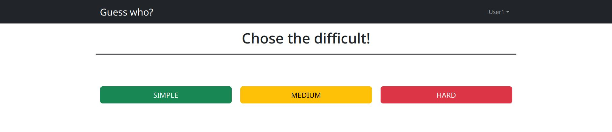
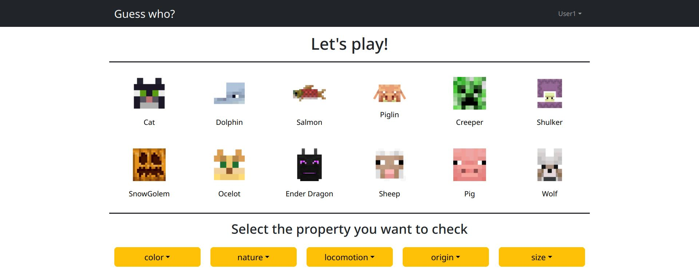
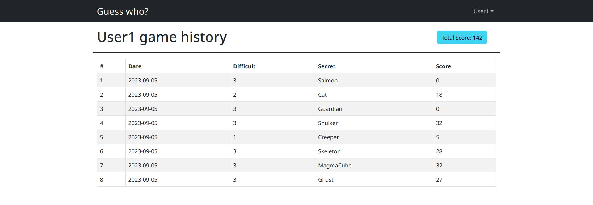

[](https://classroom.github.com/a/-RTLSo1u)

# Exam #3: "Guess Who?"

## Student: s310023 CIULLO ALESSANDRO

# Server side

## API Server

- POST `/api/login`

  - request body content : email (STRING) and password (STRING)

    ```json
    { "email": "user1@example.com", "password": "password1" }
    ```

  - response body content: a User object composed by id (NUMBER), email (STRING) and name (STRING) or an error message
    ```json
    { "id": 1, "email": "user1@example.com", "name": "User1" }
    ```
  - response status
    - `200 OK`
    - `401 Unauthorized`
    - `500 Internal Server Error`

- GET `/api/login`

  - request body: empty except session cookie
  - response body content: a User object composed by id (NUMBER), email (STRING) and name (STRING) or an error message
    ```json
    { "id": 1, "email": "user1@example.com", "name": "User1" }
    ```
  - response status
    - `200 OK`
    - `401 Unauthorized`
    - `500 Internal Server Error`

- DELETE `/api/logout`
  - request body: empty except session cookie
  - response body content: `{}` or an error message
  - response status
    - `200 OK`
    - `500 Internal Server Error`
- POST `/api/games/startgame`
  - request body: empty except session cookie
  - response body content: the game ID, a list of items and the property names
    ```json
    {
      "gameid": 1,
      "items": [
        {
          "id": 1,
          "name": "Creeper",
          "color": "Green",
          "nature": "Hostile",
          "locomotion": "Crawling",
          "origin": "Overworld",
          "size": "Medium"
        },
        {
          "id": 2,
          "name": "Zombie",
          "color": "Green",
          "nature": "Hostile",
          "locomotion": "Walking",
          "origin": "Overworld",
          "size": "Medium"
        }
      ],
      "propertyNames": ["color", "nature", "locomotion", "origin", "size"]
    }
    ```
  - response status
    - `200 OK`
    - `400 Bad request`
    - `500 Internal Server Error`
- POST `/api/games/:gameid/checkproperties`
  - request body: name and value of the selected property
    ```json
    { "property": "Origin", "value": "Overworld" }
    ```
  - response body content: an object containing `true` or `false` depending on the check or an error message
    ```json
    { "check": true }
    ```
  - response status
    - `200 OK`
    - `400 Bad request`
    - `401 Unauthorized`
    - `500 Internal Server Error`
- PUT `/api/games/:gameid/checkguess`
  - request body: name of the item we are guessing
    ```json
    { "guess": "Creeper" }
    ```
  - response body content: an object containing the secret Item and a boolean field`true` or `false` depending on the check or an error message:
    ```json
    {
      "result": {
        "check": true,
        "secretItem": {
          "id": 1,
          "name": "Creeper",
          "color": "Green",
          "nature": "Hostile",
          "locomotion": "Crawling",
          "origin": "Overworld",
          "size": "Medium"
        }
      }
    }
    ```
  - response status
    - `200 OK`
    - `400 Bad request`
    - `401 Unauthorized`
    - `500 Internal Server Error`
- GET `/api/games`
  - request body: empty except session cookie
  - response body content: the list of all the concluded games of the logged user or an error message
    ```json
    {
      "history": [
        {
          "id": 1,
          "date": "2023-09-04",
          "difficult": 2,
          "secret": "Creeper",
          "score": 17,
          "playerID": 1,
          "status": "concluded"
        },
        {
          "id": 2,
          "date": "2023-09-05",
          "difficult": 3,
          "secret": "Zombie",
          "score": 0,
          "playerID": 1,
          "status": "concluded"
        }
      ]
    }
    ```
  - response status
    - `200 OK`
    - `401 Unauthorized`
    - `500 Internal Server Error`

## Database Tables

- Table `users` - contains id (NUMBER), email (TEXT), password (TEXT, hashed), salt (TEXT), name (TEXT)
- Table `games` - contains id (NUMBER), date (TEXT), difficult (NUMBER), secret (TEXT), score (NUMBER), playerID(NUMBER, nullable), status (TEXT)
- Table `properties` - contains id (NUMBER), name (TEXT), values (TEXT: a string of comma separated values)
- Table `items` - contains id (NUMBER), name (TEXT), path(TEXT), color(TEXT), nature (TEXT), locomotion (TEXT), origin (TEXT), size (TEXT)

# Client side

## React Client Application Routes

- Route `/`: Contents: Navbar and Lobby. It's purpose is setting the difficult of the next match and navigate to the `/game/:difficult` route or one of the other you can access throught the Navbar.
- Route `/game/:difficult`: Contents: Navbar and Game component. It's the route in which the game is executed and the page offers all the needed functionality. The `difficult` parameter is used to store the difficult of the match.
- Route `/gamehistory`: Contents: the Navbar, a header and a a table containing the logged user's matches. Serves the purpose of showing the user match history.
- Route `/login`: Contents: the Navbar and a login `Form`. Offers the login functionality to the user.

## Main React Components

- `APP` (in `App.jsx`): First-Level component
- `MainLayout` (in `MainLayout.jsx`): This component renders the Navbar and contains an outlet to host other components based on the current path
- `Lobby` (in `Lobby.jsx`): this component renders the pre-game lobby by giving you the possibility to select the difficulty of your next game.
- `Game` (in `/Game/Game.jsx`): This component contains all the logic and the states to start and play the game. All the items of the current match are stored here.
- `StartInterface` (in `StartInterface`): this component renders the Start Button to initialize the game.
- `ItemGrid` (in `/Game/ItemGrid.jsx`): This component renders the grid of Items by mapping them into `Item` components and contains all the style's parameters of the grid
- `Item` (in `/Game/Item`): This component renders the single Item and launches the function `checkGuess` to terminate the game.
- `PropertyList` (in `/Game/PropertyList.jsx`): this component renders the list of Properties received into `Property` components.
- `Property` (in `/Game/Property.jsx`): This component manages the render of each single Property Selector by using a `DropDownButton` and also contains the logic to interrogate the server about the secret item's properties.
- `Login` (in `Login.jsx`): This component renders the login `Form` and takes care of its validation by using `react-hook-form` and a `yup` validation scheme.
- `MatchHistory` (in `MatchHistory.jsx`): this component renders the game history of an authorized player.
- `ErrorMessage` (in `ErrorMessage.jsx`): A parametric error alert used to report and error.

(only _main_ components, minor ones may be skipped)

# Usage info

## Example Screenshot





## Users Credentials

| email             | password  | info                                 |
| ----------------- | --------- | ------------------------------------ |
| user1@example.com | password1 | (This user already played some games) |
| user2@example.com | password2 | (This user already played some games) |
| user3@example.com | password3 | (This user never played a game)      |
